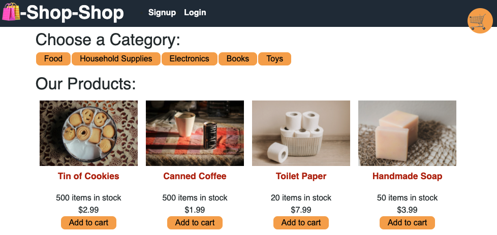
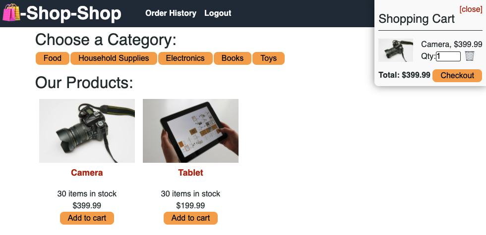

# MERN Redux Store (Bootcamp Assignment 22 - State)

By: Sadie Sial

---


#### Table of Contents

- [Description](#description)
- [Technologies](#technologies)
- [Screenshots](#screenshots)
- [Links](#links)
- [Contact](#contact)
- [License](#license)
  <br><br>

## Description <br>

This web-based application allows for users to search and purchase items using MERN technology.

### User Story:

```
AS a senior engineer working on an e-commerce platform
I WANT my platform to use Redux to manage global state instead of the Context API
SO THAT my website's state management is taken out of the React ecosystem
```

```
GIVEN an e-commerce platform that uses Redux to manage global state
WHEN I review the app’s store
THEN I find that the app uses a Redux store instead of the Context API
WHEN I review the way the React front end accesses the store
THEN I find that the app uses a Redux provider
WHEN I review the way the app determines changes to its global state
THEN I find that the app passes reducers to a Redux store instead of using the Context API
WHEN I review the way the app extracts state data from the store
THEN I find that the app uses Redux instead of the Context API
WHEN I review the way the app dispatches actions
THEN I find that the app uses Redux instead of the Context API
```

## Technologies

The technologies used to create this program were:

- HTML + CSS
- Javascript
- NodeJS
- ExpressJS
- MongoDB
- Mongo Atlas
- Apollo
- GraphQL
- Redux
- Heroku

<br>

## Screenshots

```
Logged Out Shop
```



```
Logged In Shop
```



<br>

## Links

- [Deployed App on Heroku](https://redux-store-sns.herokuapp.com/)

- [GitHub Repository](https://github.com/sadielinks/redux-store)

<br>

## Contact

- [GitHub Profile](https://github.com/sadielinks)
- [Portfolio](https://sadielinks.github.io/professional-portfolio/)
- [Email](mailto:sadiecodes@gmail.com)

<br>

## License

This source code is available to everyone under the standard [MIT license ©](https://choosealicense.com/licenses/mit/) <br><br>
© 2021 Trilogy Education Services, LLC, a 2U, Inc. brand. Confidential and Proprietary. All Rights Reserved.
